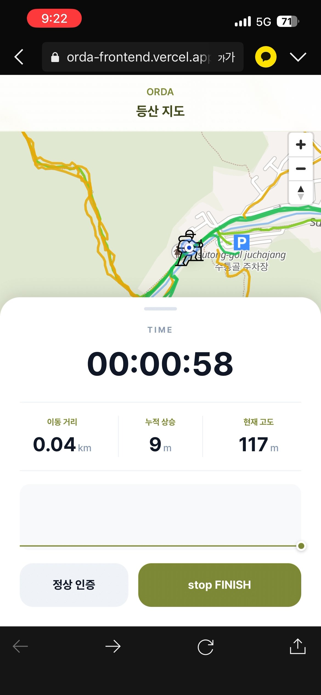
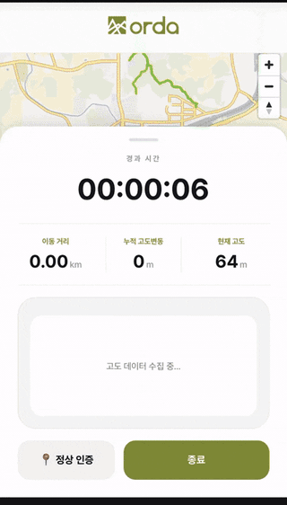
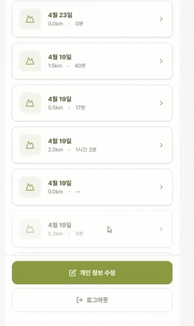
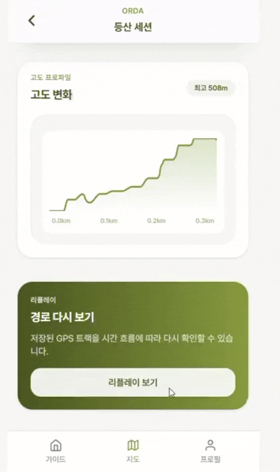
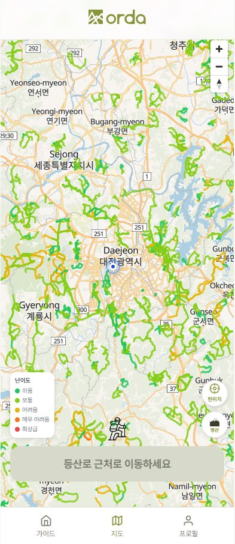
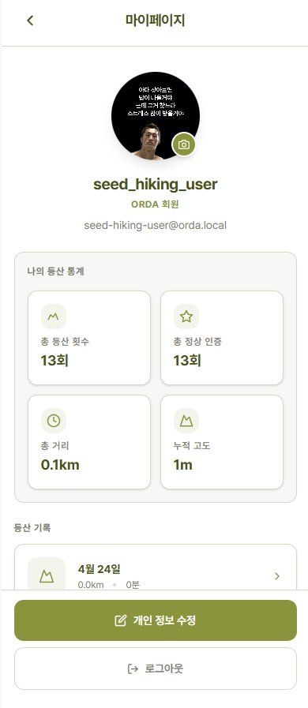
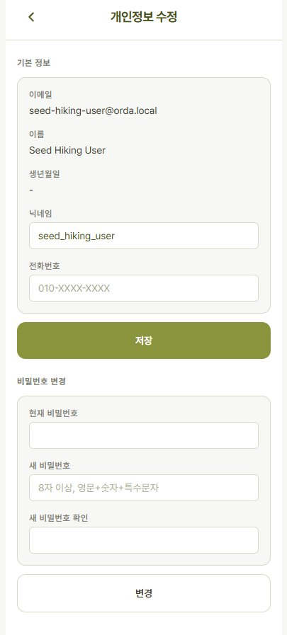

<p align="center">
  
</p>

# 🏔 ORDA : 오르다

**O**vercome, **R**ecord, **D**iscover, **A**scend — 극복하고, 기록하고, 발견하고, 오르다

> GPS 기반 등산 경로 기록 및 지도 시각화 플랫폼

사용자의 등산 경로를 실시간으로 기록하고, 정상 도달 여부를 인증하며, 난이도 지도와 2D 경로 리플레이를 통해 등산 경험을 직관적으로 확인할 수 있는 서비스입니다.

🔗 **배포 링크**: [https://orda-frontend.vercel.app/](https://orda-frontend.vercel.app/)

---

## 📌 프로젝트 소개

- **프로젝트 기간**: 2026.03.04 ~ 2026.04.24
- **팀명**: ORDA

### 프로젝트 목적

1. GPS 기반으로 등산 경로를 실시간 기록하고, 등산 후에도 경로를 다시 돌아볼 수 있게 한다.
2. 정상 좌표와 사용자 위치를 비교하여 정상 도달 여부를 신뢰성 있게 인증한다.
3. 난이도 지도와 2D 경로 리플레이로 등산 데이터를 직관적으로 시각화한다.

### 핵심 기술

- **GPS 기반 위치 추적 및 등산 경로 기록**
- **정상 좌표와 사용자 위치 비교 기반 정상 인증** (GPS + AI 사진 인증)
- **MapLibre 기반 난이도 지도 및 2D 경로 리플레이**
- **PostGIS 기반 공간 데이터 저장 및 처리**

---

## 👥 팀원 소개

<table>
  <tbody>
    <tr>
      <td align="center">
        <br/>
        <sub>팀장</sub><br/>
        <sub><b>김지현</b></sub>
      </td>
      <td align="center">
        <br/>
        <sub>팀원</sub><br/>
        <sub><b>이윤지</b></sub>
      </td>
      <td align="center">
        <br/>
        <sub>팀원</sub><br/>
        <sub><b>윤종민</b></sub>
      </td>
    </tr>
  </tbody>
</table>

| 이름 | 역할 | GitHub | Velog |
| --- | --- | --- | --- |
| **김지현** | 팀장 / 고도 처리, 세션 상세, 리플레이, 공통 API 구조, 운영 기반 | [GitHub](https://github.com/maycode28) | [Velog](https://velog.io/@maycode28/posts) |
| **이윤지** | 인증/회원, GPS 수집, 등산 시작/종료, AI + GPS 정상 인증, 디자인, 공통 컴포넌트 | [GitHub](https://github.com/Leeeydia) | [Velog](https://velog.io/@leeeydia/posts) |
| **윤종민** | 난이도 지도, 100대 명산 모드, 마이페이지, 개인정보 수정, 홈, 가이드, 지도 공통 기반 | [GitHub](https://github.com/yxh750501-sys) | [Velog](https://velog.io/@yxh750507/posts) |

---

## 🎥 실행 화면

<p align="center">
  
</p>

> 등산 시작 / GPS 추적 → 세션 상세 → 2D 리플레이 → 정상 인증 → 난이도 지도 → 마이페이지까지 전체 기능 시연 (약 1분 54초)

---

## 🏗 기술 스택

### Frontend

[](https://react.dev/)
[](https://www.typescriptlang.org/)
[](https://vitejs.dev/)
[](https://tailwindcss.com/)
[](https://reactrouter.com/)
[](https://tanstack.com/query)
[](https://maplibre.org/)
[](https://axios-http.com/)

### Backend

[](https://www.oracle.com/java/)
[](https://spring.io/projects/spring-boot)
[](https://spring.io/projects/spring-security)
[](https://hibernate.org/)
[](https://jwt.io/)
[](https://platform.openai.com/)

### Database / Infra

[](https://www.postgresql.org/)
[](https://postgis.net/)
[](https://supabase.com/)
[](https://cloud.google.com/run)
[](https://vercel.com/)

### Tools / Collaboration

[](https://github.com/)
[](https://www.figma.com/)
[](https://www.notion.so/)
[](https://slack.com/)

---

## 🍀 주요 기능

<details>
<summary><strong>1. 회원가입 / 로그인</strong></summary>

<p align="center">
  
  
</p>

- **이메일/비밀번호 로그인**: JWT 기반 인증, Bearer 토큰 자동 부착
- **카카오 OAuth 로그인**: 인가 코드 검증 후 자동 회원가입 / 로그인
- **회원가입**: 이메일·닉네임·전화번호 중복 검증, 생년월일/전화번호 자동 포매팅
- **보안 강화**: BCrypt 비밀번호 해시, 비밀번호=이메일 금지 검증

</details>

<details>
<summary><strong>2. 등산 시작 / GPS 실시간 추적</strong></summary>

<p align="center">
  
</p>

- **등산로 근접 검증**: 반경 100m 내 등산로 검증 후 세션 시작
- **실시간 GPS 추적**: `navigator.geolocation.watchPosition` 기반, 5초 간격 서버 저장
- **주변 정상 표시**: 반경 3km 내 정상 목록을 지도에 마커로 표시
- **난이도 지도 레이어**: 뷰포트(bbox) 기반으로 등산로 난이도 색상 표시
- **100대 명산 모드**: 정적 데이터 기반으로 명산 위치 및 정보 제공
- **고도/거리/경과시간 패널**: Haversine 기반 거리 누적, 고도 차트 실시간 갱신
- **안정성**: `beforeunload` 시 `navigator.sendBeacon`으로 세션 종료 보장

</details>

<details>
<summary><strong>3. 정상 인증 (GPS + AI 사진)</strong></summary>

<p align="center">
  
</p>

- **GPS 인증**: 최근접 정상 반경 내 진입 시 자동 인증, 중복 인증 회피
- **AI 사진 인증**: OpenAI Vision (gpt-4o-mini) 기반
  - 이미지 512px 리사이즈 → Base64 인코딩
  - GPS 반경 + AI 정상석 인식 + 정상명 매칭 **3조건 AND** 판정
  - 성공 시에만 사진 저장 + DB 기록
- **후면 카메라 + 정상석 가이드 오버레이**로 사용자 촬영 보조

</details>

<details>
<summary><strong>4. 세션 상세 / 고도 프로파일</strong></summary>

<p align="center">
  
</p>

- **트랙 시각화**: GeoJSON FeatureCollection으로 지도에 경로 표시
- **인증 정상 마커**: 해당 세션에서 인증된 정상을 마커로 강조
- **요약 카드**: 총 거리 / 소요 시간 / 상승 고도 / 하강 고도
- **고도 프로파일 차트**: SVG path로 평활화된 고도 그래프

</details>

<details>
<summary><strong>5. 2D 리플레이</strong></summary>

<p align="center">
  
</p>

- **카메라 모드 4단계**: `intro-overview → focus-start → follow → outro-overview`
- **재생 컨트롤**: 재생/일시정지 / 5초 뒤로 / 처음으로 / 슬라이더 seek
- **점진적 정상 노출**: 재생 시점이 지난 인증 정상만 순차 표시
- **선형 보간**: 포인트 사이를 부드럽게 연결하여 자연스러운 재생
- **샘플링 옵션**: `maxPoints`, `targetDurationSeconds` 쿼리 파라미터 제어

</details>

<details>
<summary><strong>6. 난이도 지도</strong></summary>

<p align="center">
  
</p>

- **난이도 계산**: 거리 / 경사도 / 고도차 기반 난이도 스코어
- **조회 방식 다양화**: 전체 / 정상별 / 뷰포트(bbox) / 특정 edge 목록
- **GeoJSON LineString**으로 응답 → 지도에 바로 렌더링

</details>

<details>
<summary><strong>7. 마이페이지 / 프로필 관리</strong></summary>

<p align="center">
  
  
</p>

- **누적 통계**: 총 등산 횟수 / 정상 인증 수 / 누적 거리 / 누적 상승 고도
- **등산 기록 리스트**: 날짜 내림차순, 클릭 시 세션 상세로 이동
- **프로필 이미지**: 업로드(jpg/png, ≤5MB) / 삭제
- **프로필 수정**: 닉네임·전화번호 수정, 비밀번호 변경(현재 비번 검증)

</details>

<details>
<summary><strong>8. 가이드 페이지</strong></summary>

<p align="center">
  
</p>

- 등산 준비물 / 안전 수칙 / 산행 예절 등 정적 정보 제공
- 오늘의 명언 (`dayOfYear` 기반으로 매일 다른 문구 노출)

</details>

---

## 🗣️ 기술적 의사결정

### **Frontend 프레임워크 - React 19 + Vite**

[](https://react.dev/)
[](https://vitejs.dev/)

최신 React 19의 Suspense와 개선된 렌더링 성능을 활용할 수 있으며, Vite의 빠른 HMR로 개발 생산성을 확보했습니다.  
SPA 특성상 지도 인터랙션이 중심인 ORDA에 React의 컴포넌트 기반 렌더링이 가장 적합했습니다.

---

### **개발 편의성 - TypeScript**

[](https://www.typescriptlang.org/)

GeoJSON과 API 응답의 복잡한 타입 구조를 명시적으로 정의하여 코드 안정성을 높였습니다.  
특히 좌표 순서 `[경도, 위도]`와 같은 실수를 컴파일 타임에 잡아낼 수 있어 지도 관련 버그를 크게 줄였습니다.

---

### **지도 라이브러리 - MapLibre GL + OpenFreeMap**

[](https://maplibre.org/)

Mapbox의 오픈소스 포크로 토큰/과금 제약 없이 사용 가능합니다.  
OpenFreeMap 타일과 결합하여 운영 비용 없이 벡터 지도를 제공하며, GeoJSON 소스 기반으로 실시간 트랙 업데이트 시 지도 재생성 없이 데이터만 교체하는 구조로 성능을 확보했습니다.

---

### **서버상태관리 - TanStack Query**

[](https://tanstack.com/query)

세션/트랙/고도/리플레이 등 여러 쿼리를 병렬 조회하며 자동 캐싱으로 재방문 시 즉시 표시됩니다.  
로딩/에러/성공 상태를 선언적으로 관리할 수 있어 비동기 처리가 간소화됩니다.

---

### **CSS - Tailwind CSS v4**

[](https://tailwindcss.com/)

`@theme` 기반 디자인 토큰으로 디자인 시스템을 일관되게 유지했습니다.  
모바일 웹(390px 기준)에 최적화된 유틸리티 클래스로 빠른 스타일링이 가능하며, 팀원 간 디자인 편차를 줄일 수 있었습니다.

---

### **Backend 프레임워크 - Spring Boot 3.5**

[](https://spring.io/projects/spring-boot)

JPA, Security, WebFlux 등 필요한 모듈을 빠르게 통합할 수 있으며,  
Hibernate Spatial과 같은 공간 데이터 확장과의 호환성도 우수합니다.

---

### **공간 데이터 - PostgreSQL + PostGIS + Hibernate Spatial**

[](https://www.postgresql.org/)
[](https://postgis.net/)

ORDA의 핵심인 GPS 경로, 정상 좌표, 등산로 edge는 모두 공간 데이터입니다.  
PostGIS의 공간 인덱스로 "반경 내 정상 조회", "뷰포트(bbox) 기반 등산로 조회" 같은 쿼리를 빠르게 수행할 수 있었습니다.  
Hibernate Spatial + JTS를 조합하여 JPA 레벨에서 자연스럽게 공간 타입을 다뤘습니다.

---

### **인증 - JWT + Spring Security (Stateless)**

[](https://jwt.io/)

세션을 사용하지 않는 Stateless 구조로 Cloud Run의 오토스케일 환경에 적합합니다.  
카카오 OAuth는 인가 코드를 서버에서 검증한 뒤 자체 JWT로 교환하여 통일된 인증 플로우를 유지했습니다.

---

### **AI 정상 인증 - OpenAI Vision**

[](https://platform.openai.com/)

GPS만으로는 오차나 조작 가능성이 있어 신뢰성이 부족합니다.  
**GPS 반경 + AI 정상석 인식 + 정상명 매칭**을 AND 조건으로 결합하여 인증 신뢰도를 확보했으며,  
이미지를 512px로 리사이즈 후 Base64 전송하여 토큰 비용을 최소화했습니다.

---

### **DB - Supabase**

[](https://supabase.com/)

관리형 PostgreSQL을 빠르게 프로비저닝할 수 있고 PostGIS 확장을 지원합니다.  
별도의 DB 운영 없이 공간 쿼리 기반 서비스를 구축할 수 있었습니다.

---

### **Backend 배포 - Google Cloud Run**

[](https://cloud.google.com/run)

컨테이너 기반 무상태 배포 플랫폼으로, 요청량에 따라 자동으로 스케일링됩니다.  
트래픽이 없을 때는 0으로 수렴하여 비용 효율적이며, Stateless JWT 인증 구조와도 잘 맞습니다.

---

### **Frontend 배포 - Vercel**

[](https://vercel.com/)

Vite 빌드를 자동 감지하여 코드 변경 시 빠르고 간단하게 배포됩니다.  
PR 프리뷰 URL로 디자이너 및 팀원과의 리뷰가 원활했습니다.

---

### **협업 도구 - GitHub / Figma / Notion / Slack**

[](https://github.com/)
[](https://www.figma.com/)
[](https://www.notion.so/)
[](https://slack.com/)

GitHub Flow 기반 PR/리뷰, Figma 디자인 시스템 공유, Notion으로 API 명세 및 회의록 관리,  
Slack으로 실시간 커뮤니케이션을 통해 협업 효율을 극대화했습니다.

---

## ☁️ 배포 환경

| 구분 | 서비스 | 비고 |
| --- | --- | --- |
| **Frontend** | Vercel | Vite 빌드 자동 배포, PR 프리뷰 |
| **Backend** | Google Cloud Run | 무상태 컨테이너, 요청량 기반 오토스케일 |
| **Database** | Supabase (PostgreSQL + PostGIS) | PostGIS 확장으로 공간 쿼리 |
| **AI** | OpenAI API (gpt-4o-mini Vision) | 정상 사진 인증 |
| **외부 연동** | 카카오 OAuth | 소셜 로그인 |

### 배포 아키텍처

```
[사용자]
   │
   ▼
[Vercel] ──── Frontend (React + MapLibre)
   │
   ▼  HTTPS / JWT
[Cloud Run] ── Backend (Spring Boot)
   │
   ├──▶ [Supabase PostgreSQL + PostGIS]  ← 등산 세션 / 트랙 / 정상 / 등산로
   ├──▶ [OpenAI Vision API]               ← 정상 사진 AI 인증
   └──▶ [카카오 OAuth API]                ← 소셜 로그인
```

---

## 🛠 트러블슈팅

<details>
<summary><strong>1. 지도 데이터 품질 정리 — OSM + 공공데이터 혼합 구조 재정비</strong></summary>

### 🚨 문제
난이도 지도에 **산책로, 공원길, 일반 도로**가 등산로처럼 표시되어 사용자가 실제 등산로를 식별하기 어려웠습니다.

### 🚨 원인
공공데이터(국립공원공단, 산림청)와 OSM을 혼합한 구조에서 OSM 측의 태그 기반 필터링이 불완전했습니다. OSM에는 등산로뿐만 아니라 산책로·도보길·일반도로가 유사 태그로 섞여 들어와 있었습니다.

### 💡 해결
- OSM 데이터를 일시적으로 배제하고 **공공 등산로 데이터만 사용**하도록 파이프라인을 조정했습니다.
- 등산로 조각(edge) 수: **약 112,000개 → 55,000개** 로 감소.
- 지도 품질이 크게 개선되어, 실제 등산로만 난이도 레이어에 표시됩니다.

> 🖼 *[이미지 플레이스홀더: 정리 전 난이도 지도]*  
> 🖼 *[이미지 플레이스홀더: 정리 후 난이도 지도]*

</details>

<details>
<summary><strong>2. GPS canonical 보정 — 원시 GPS → 스냅 + DEM 고도</strong></summary>

### 🚨 문제
Raw GPS를 그대로 사용하면 트랙이 **등산로 밖에 찍히고**, **고도 값이 튀는** 문제가 발생했습니다. 이로 인해 경로 시각화, 상승/하강 고도 집계, 고도 프로파일 그래프의 신뢰도가 낮았습니다.

### 💡 해결
- **등산로 스냅**: PostGIS `ST_ClosestPoint` 로 raw 좌표를 가장 가까운 등산로 edge 위로 스냅.
- **고도 샘플링**: NASADEM GeoTIFF에서 해당 좌표의 DEM 고도를 샘플링.
- **4단계 분리 저장**: `raw` / `snapped` / `canonical` / `elevation_source` 컬럼으로 단계별 값을 모두 보존하여 후처리·디버깅을 가능하게 설계.

**결과**: 트랙 신뢰도와 고도 그래프 품질이 모두 개선되었고, 필요 시 원본 raw 값으로 언제든 롤백 가능한 구조가 되었습니다.

> 🖼 *[이미지 플레이스홀더: GPS raw vs snapped 비교 지도]*  
> 🖼 *[이미지 플레이스홀더: 고도 그래프 before / after]*

</details>

<details>
<summary><strong>3. DEM 배포 / 메모리 문제 — OOM → Docker 포함 + Cloud Run</strong></summary>

### 🚨 문제
앱 시작 시 DEM(수치표고모델) 전체를 eager load 하는 구조로 인해 **OOM(OutOfMemoryError)** 이 발생하여 서버가 기동되지 않았습니다.

### 🚨 원인
대용량 GeoTIFF 파일을 런타임에서 통째로 읽어 힙 메모리에 적재하는 구조. DEM 파일 자체의 크기 + mil.nga:tiff 파서의 메모리 사용량이 배포 환경의 기본 힙을 초과했습니다.

### 💡 해결
- **Docker 이미지에 DEM을 포함**하여 런타임 네트워크·디스크 접근 경로를 단순화.
- **힙 메모리 상향** (JVM -Xmx 조정).
- **Cloud Run으로 우회**: 메모리 할당 여유가 있는 Cloud Run 인스턴스로 배포하여 로컬 환경 제약을 우회.

**결과**: 테스트 가능한 운영 상태를 확보. 이후 구조는 lazy load / 타일 단위 청크 로딩으로 개선할 여지가 남아있습니다.

> 🖼 *[도식 플레이스홀더: DEM 포함 Docker → Cloud Run 배포 구조]*  
> 📄 *[로그 플레이스홀더: OOM 로그 또는 DEM 로드 성공 로그]*

</details>

### 그 외 해결한 이슈

<details>
<summary><strong>4. 직선 등산로 제거 필터</strong></summary>

- 정상 등산로 데이터의 99.9%는 **좌표 간격이 92.5m 이내**.
- 오류 데이터의 경우 좌표 간격이 **최대 19km** 까지 벌어져 지도에 말도 안 되는 직선이 그어지는 현상 발생.
- **500m 초과 구간이 있으면 해당 선형을 제거**하는 필터를 추가하여 지도 품질 확보.

</details>

<details>
<summary><strong>5. 카카오 로그인 연쇄 오류 해결</strong></summary>

카카오 OAuth 연동 시 다음 이슈들이 동시에 발생 → **단계적으로 분리하여 해결**.

- Redirect URI 불일치
- 환경변수 미설정
- client secret 누락
- DB 컬럼 스키마 불일치
- NOT NULL 제약 조건 위반

</details>

<details>
<summary><strong>6. 좌표계 오류 + 시각화 검증</strong></summary>

- 공공데이터 일부 좌표가 **동해·대만 근방**에 찍히는 현상 발견.
- 원인은 **입력 좌표계 해석 문제**. 시각화로 검증하다가 **병합 로직 결함**까지 같이 발견했습니다.
- 이후 파이프라인에 시각화 단계를 상시 포함하여 이상 좌표를 조기에 잡을 수 있도록 개선.

</details>

<details>
<summary><strong>7. 100대 명산 모드 커버리지 이슈 (진행 중)</strong></summary>

- 같은 명산 영역에서 일반 모드 대비 **명산 모드에 표시되는 등산로가 부족**한 구간이 존재.
- 최소 동작은 복구했으며, 근본 원인은 **데이터 커버리지와 매핑 한계**로 파악됨.
- 후속 작업: 명산 ↔ edge 매핑 규칙 재정의 + 누락 edge 보강.

</details>

---

## 📁 프로젝트 구조

### Backend (`com.orda.backend`)

```
common/         ApiResponse, GeoJSON DTO, GlobalExceptionHandler
config/         Security / CORS / WebMvc
security/       JWT, CustomUserDetails
domain/
  ├─ user/      회원가입, 로그인, 카카오, 마이페이지, 설정
  ├─ hiking/    세션 시작/종료, GPS 트랙, 고도 프로파일, 리플레이
  ├─ summit/    정상 GPS 인증, AI 사진 인증
  ├─ trail/     난이도 조회, GeoJSON 지도
  ├─ mountain/  100대 명산
  └─ stats/     누적 통계 (UserStats Entity)
```

### Frontend (`src/`)

```
pages/          splash / auth / guide / hiking / mypage
features/       auth / hiking / gps / trail / mountain / summit / mypage / edit-profile
components/     auth / layout / map(CommonMap) / ui
lib/            axios 인터셉터
utils/          auth / format / validate / apiError
```

---

<p align="center">
  Made with ⛰ by Team ORDA
</p>
